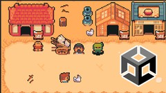

# Learn how to create a 2D RPG game with Unity

## Über dieses Projekt

Dieses Projekt wurde im Rahmen des Udemy-Kurses "Lerne, wie man ein 2D RPG-Spiel mit Unity erstellt" entwickelt, geleitet von Gianny Dantas. Der Kurs konzentriert sich darauf, die Grundlagen der 2D-Spielentwicklung mit Unity zu erlernen und ein RPG-Spiel zu erstellen.

### Kurslink

[Lerne, wie man ein 2D RPG-Spiel mit Unity erstellt](https://www.udemy.com/course/learn-how-to-create-a-2d-rpg-game-with-unity/)

### Instruktor

Gianny Dantas - ein erfahrener Entwickler und Instruktor für Unity-Spieleentwicklung.

[Youtube-Kanal des Kursleiters](https://www.youtube.com/channel/UCvEAy4KqYvUT7VYDmAObwUA)

## Verwendung von Kursmaterialien

Die in diesem Projekt verwendeten Grafiken und anderen Ressourcen wurden vom Kursleiter Gianny Dantas zur Verfügung gestellt. Diese Materialien sind ausschließlich für Bildungs- und Lernzwecke innerhalb des Kurses gedacht.

### Kommerzielle Nutzung

Für die Verwendung dieser Grafiken und Ressourcen zu kommerziellen Zwecken ist eine ausdrückliche Genehmigung des Urhebers, Gianny Dantas, erforderlich. Bitte kontaktieren Sie Gianny Dantas direkt, um eine solche Genehmigung zu erhalten oder weitere Informationen zu den Nutzungsbedingungen zu erfragen.

## Lizenz

Dieses Projekt ist nur für Bildungs- und Lernzwecke unter Beachtung der Richtlinien und Bedingungen des Udemy-Kurses und der Anweisungen von Gianny Dantas bestimmt. Jegliche Verbreitung, Reproduktion oder kommerzielle Nutzung der Kursmaterialien ohne vorherige Genehmigung ist strikt untersagt.

## Kontakt

Falls Sie Fragen zu diesem Projekt haben oder eine Genehmigung für die Verwendung der Kursmaterialien suchen, wenden Sie sich bitte direkt an [Gianny Dantas](https://www.linkedin.com/in/gianny-dantas).